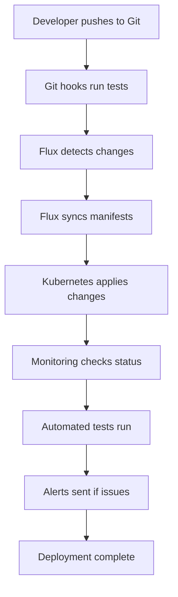

# 🚀 Complete GitOps Automation Pipeline

This document describes the complete automation setup that handles everything from Git push to deployment without manual intervention.

## 📋 Overview

The automation pipeline includes:
- **Automatic Git sync** via Flux
- **Automatic reconciliation** of changes
- **Automated testing** and validation
- **Monitoring and alerting** for deployments
- **Git hooks** for pre-push validation
- **Systemd services** for background processes

## 🔄 Automation Workflow



## 🛠️ Setup Instructions

### 1. Run the Automation Setup Script

```bash
# On your server, run the setup script
./setup-gitops-automation.sh
```

### 2. Start Background Services

```bash
# Start automatic reconciliation
sudo systemctl start flux-reconcile

# Start monitoring
sudo systemctl start deployment-monitor

# Enable services to start on boot
sudo systemctl enable flux-reconcile
sudo systemctl enable deployment-monitor
```

### 3. Verify Setup

```bash
# Check Flux status
flux get kustomizations -n flux-system

# Run automated tests
/tmp/automated-tests.sh

# Check deployment status
kubectl -n web get all -l app=blog
```

## 🔧 Components

### Flux Configuration
- **GitRepository**: Automatically syncs from GitHub
- **Kustomization**: Applies manifests from `./clusters/prod`
- **Reconciliation**: Runs every minute automatically

### Monitoring
- **Pod Status**: Monitors pod health every minute
- **Deployment Status**: Tracks deployment progress
- **Error Detection**: Alerts on CrashLoopBackOff, ImagePullBackOff, etc.
- **Logging**: All events logged to `/tmp/deployment-monitor.log`

### Testing
- **Pre-push Tests**: Run before every Git push
- **Deployment Tests**: Verify deployment success
- **Health Checks**: Test application endpoints
- **Resource Validation**: Ensure all resources exist

### Git Hooks
- **Pre-push**: Runs automated tests before push
- **Validation**: Ensures code quality and functionality
- **Abort on Failure**: Prevents broken code from being pushed

## 📊 Monitoring and Alerts

### Real-time Monitoring
```bash
# Watch deployment status
watch -n 5 'kubectl -n web get pods -l app=blog -o wide'

# Monitor Flux sync
watch -n 5 'flux get kustomizations -n flux-system'

# Check logs
tail -f /tmp/deployment-monitor.log
```

### Alert Conditions
- Pods in Error state
- CrashLoopBackOff detected
- ImagePullBackOff detected
- Health check failures
- Resource creation failures

## 🚀 Usage

### Normal Development Workflow
1. **Make changes** to your code/manifests
2. **Commit changes** to Git
3. **Push to repository** (tests run automatically)
4. **Flux detects changes** and syncs automatically
5. **Deployment happens** without manual intervention
6. **Monitoring alerts** if issues occur

### Manual Operations
```bash
# Force reconciliation
flux reconcile kustomization flux-system -n flux-system

# Run tests manually
/tmp/automated-tests.sh

# Deploy manually
/tmp/deploy-automation.sh

# Check status
flux get kustomizations -n flux-system
kubectl -n web get all -l app=blog
```

## 🔍 Troubleshooting

### Common Issues

1. **Flux not syncing**
   ```bash
   # Check GitRepository status
   kubectl -n flux-system get gitrepositories
   
   # Force reconciliation
   flux reconcile source git flux-system -n flux-system
   ```

2. **Pods not starting**
   ```bash
   # Check pod logs
   kubectl -n web logs -l app=blog --tail=50
   
   # Check events
   kubectl -n web get events --sort-by='.lastTimestamp'
   ```

3. **Tests failing**
   ```bash
   # Run tests with verbose output
   /tmp/automated-tests.sh
   
   # Check test results
   cat /tmp/test-results.log
   ```

### Log Locations
- **Flux logs**: `kubectl -n flux-system logs -l app=source-controller`
- **Deployment logs**: `kubectl -n web logs -l app=blog`
- **Monitoring logs**: `/tmp/deployment-monitor.log`
- **Test results**: `/tmp/test-results.log`

## 📈 Benefits

✅ **Zero Manual Intervention**: Everything happens automatically  
✅ **Fast Deployments**: Changes deployed within minutes  
✅ **Quality Assurance**: Tests run before every deployment  
✅ **Monitoring**: Real-time status and alerts  
✅ **Rollback Capability**: Easy to revert changes via Git  
✅ **Audit Trail**: Complete history of all changes  
✅ **Scalability**: Easy to add more applications  

## 🔧 Customization

### Adding New Applications
1. Create manifests in `./clusters/prod/apps/new-app/`
2. Add to kustomization.yaml
3. Push to Git
4. Flux automatically deploys

### Modifying Tests
Edit `/tmp/automated-tests.sh` to add new test cases.

### Changing Monitoring
Edit `/tmp/monitor-deployments.sh` to modify alert conditions.

## 📞 Support

For issues or questions:
1. Check the logs first
2. Run the troubleshooting commands
3. Verify Flux and Kubernetes status
4. Check the monitoring logs

---

**🎉 Your GitOps automation pipeline is now fully operational!**
