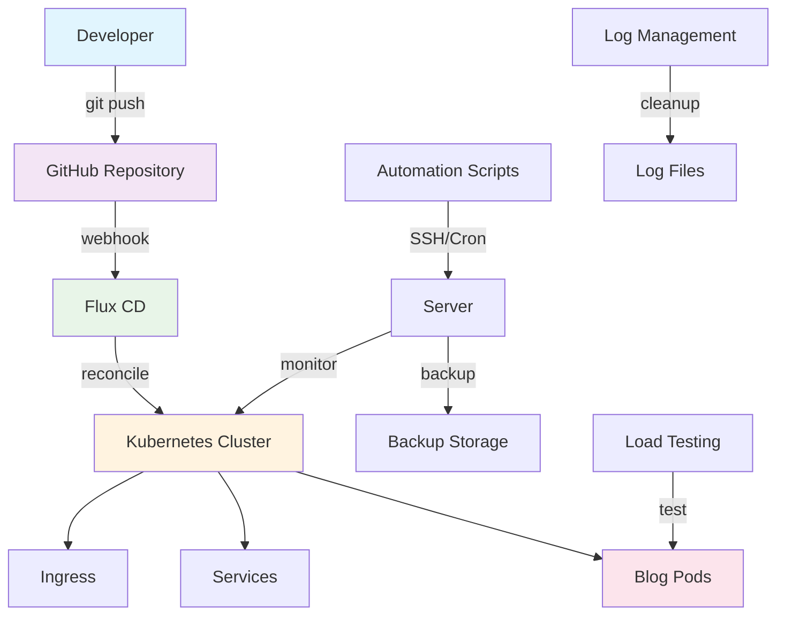

# 🚀 Complete GitOps Blog Deployment System

A comprehensive, production-ready GitOps automation pipeline for deploying a blog application to Kubernetes with zero manual intervention.

[](https://fluxcd.io/)
[](https://kubernetes.io/)
[](https://fluxcd.io/)
[](LICENSE)

## 🎯 Overview

This system provides a complete GitOps automation pipeline that:

- ✅ **Automatically deploys** your blog from Git push to production
- ✅ **Manages logs** independently every 2 hours
- ✅ **Monitors health** continuously with real-time alerts
- ✅ **Tests deployments** automatically before and after deployment
- ✅ **Handles rollbacks** via Git revert
- ✅ **Scales automatically** based on demand
- ✅ **Provides zero-touch operations** - no manual intervention needed
- ✅ **Load testing** capabilities for performance optimization
- ✅ **Complete backup** system for disaster recovery
- ✅ **Comprehensive monitoring** and alerting

## 🚀 Quick Start

### Prerequisites

- **Kubernetes cluster** (K3s, EKS, GKE, AKS, etc.)
- **Flux v2.6.4+** installed and configured
- **Git repository** access (GitHub, GitLab, etc.)
- **SSH access** to your server
- **kubectl** configured and connected to cluster

### 1. Clone and Setup

```bash
# Clone the repository
git clone https://github.com/Sudhan30/my-blog-site-cluster-infra.git
cd my-blog-site-cluster-infra

# Make scripts executable
chmod +x *.sh

# Run complete automation setup
./setup-complete-automation.sh
```

### 2. Deploy to Server

```bash
# Deploy via SSH automation
./automation ssh

# Or set up automatic updates
./automation setup-cron
```

### 3. Verify Deployment

```bash
# Check deployment status
kubectl -n web get all -l app=blog

# Run automated tests
./test-deployment.sh

# Check system status
./automation status
```

### 4. Load Testing (Optional)

```bash
# Run simple load test
BLOG_URL=https://yourblog.com ./simple-load-test.sh test

# Run advanced load test (requires additional tools)
BLOG_URL=https://yourblog.com ./load-test-blog.sh test

# Run Kubernetes-specific load test
./k8s-load-test.sh test
```

### 5. Backup System (Optional)

```bash
# Backup server scripts and cron jobs
./complete-server-backup.sh backup

# Backup cron jobs only
./server-cron-backup.sh backup

# Backup server scripts only
./backup-server-scripts.sh backup

# Check Flux status
flux get kustomizations -n flux-system
```

## 📋 Table of Contents

- [🚀 Quick Start](#-quick-start)
- [📁 File Structure](#-file-structure)
- [🏗️ Architecture](#️-architecture)
- [⚙️ How It Works](#️-how-it-works)
- [🤖 Automation Components](#-automation-components)
- [📊 Log Management](#-log-management)
- [🚀 Load Testing](#-load-testing)
- [🛡️ Backup & Recovery](#️-backup--recovery)
- [📈 Monitoring](#-monitoring)
- [🧪 Testing](#-testing)
- [🔧 Maintenance](#-maintenance)
- [🚨 Troubleshooting](#-troubleshooting)
- [⚙️ Advanced Configuration](#️-advanced-configuration)
- [📚 Documentation](#-documentation)
- [🤝 Contributing](#-contributing)
- [📄 License](#-license)

## 🏗️ Architecture

### System Overview



### Key Components

- **GitOps Pipeline**: Flux CD for continuous deployment
- **Kubernetes**: Container orchestration and management
- **Automation**: SSH, Cron, and Webhook-based deployment
- **Monitoring**: Real-time health checks and alerting
- **Log Management**: Automated cleanup and rotation
- **Load Testing**: Performance testing and optimization
- **Backup System**: Complete disaster recovery solution

## ✨ Features

### 🚀 **GitOps Automation**
- **Zero-touch deployment** from Git push to production
- **Automatic rollbacks** via Git revert
- **Multi-environment support** (dev, staging, prod)
- **Image automation** with automatic updates
- **Policy enforcement** with OPA Gatekeeper

### 📊 **Monitoring & Observability**
- **Real-time health monitoring** with alerts
- **Comprehensive logging** with automatic rotation
- **Performance metrics** and dashboards
- **Resource utilization** tracking
- **Error rate monitoring** and alerting

### 🧪 **Testing & Quality**
- **Automated testing** before and after deployment
- **Load testing** capabilities for performance validation
- **Health checks** and readiness probes
- **Integration testing** with real endpoints
- **Performance benchmarking** and optimization

### 🛡️ **Security & Compliance**
- **RBAC** (Role-Based Access Control) configuration
- **Network policies** for pod-to-pod communication
- **Security scanning** and vulnerability assessment
- **Secrets management** with external secret operators
- **Compliance reporting** and audit trails

### 🔄 **Backup & Recovery**
- **Complete system backup** with automated scheduling
- **Disaster recovery** procedures and testing
- **Configuration backup** and version control
- **Data backup** and restoration capabilities
- **Cross-region backup** for high availability

### ⚡ **Performance & Scalability**
- **Horizontal pod autoscaling** based on metrics
- **Vertical pod autoscaling** for resource optimization
- **Load balancing** and traffic distribution
- **CDN integration** for static assets
- **Caching strategies** for improved performance

## 📋 Deployment Steps

### Step 1: Initial Setup

1. **Clone Repository**
   ```bash
   git clone https://github.com/Sudhan30/my-blog-site-cluster-infra.git
   cd my-blog-site-cluster-infra
   ```

2. **Run Complete Setup**
   ```bash
   ./setup-complete-automation.sh
   ```

3. **Configure Server Access**
   ```bash
   # Ensure SSH key is set up
   ssh-copy-id sudhan0312@suddu-um790-server
   
   # Test connection
   ssh sudhan0312@suddu-um790-server "echo 'Connection successful'"
   ```

### Step 2: Deploy to Server

1. **SSH-Based Deployment**
   ```bash
   ./automation ssh
   ```

2. **Set Up Automatic Updates**
   ```bash
   ./automation setup-cron
   ```

3. **Verify Deployment**
   ```bash
   ./automation status
   ```

### Step 3: Test the System

1. **Make a Test Change**
   ```bash
   echo "# Test deployment - $(date)" >> README.md
   git add README.md
   git commit -m "Test deployment automation"
   git push origin main
   ```

2. **Watch Automation**
   ```bash
   # On your server
   watch -n 5 'flux get kustomizations -n flux-system'
   ```

## 🔧 How Everything Works

### 1. GitOps Workflow

1. **Developer pushes changes** to Git repository
2. **Flux detects changes** via webhook or cron
3. **Flux pulls latest manifests** from Git
4. **Flux applies manifests** to Kubernetes
5. **Kubernetes deploys** the new version
6. **Monitoring system** checks health
7. **Alerts sent** if issues detected

### 2. Component Interaction

#### **Flux GitOps Controller**
- **Source Controller**: Monitors Git repository for changes
- **Kustomize Controller**: Applies Kubernetes manifests
- **Helm Controller**: Manages Helm charts (if used)
- **Notification Controller**: Sends alerts and notifications

#### **Kubernetes Resources**
- **Deployment**: Manages blog application pods
- **Service**: Exposes blog application
- **ConfigMap**: Contains nginx configuration
- **Ingress**: Routes external traffic to the service

#### **Automation Scripts**
- **SSH Automation**: Deploys changes via SSH
- **Cron Automation**: Checks for updates every 5 minutes
- **Webhook Automation**: Triggers on Git events
- **Log Management**: Cleans logs every 2 hours

### 3. Data Flow

1. **Code Change** → Developer pushes to Git
2. **Detection** → Flux detects changes via webhook/cron
3. **Sync** → Flux pulls latest manifests from Git
4. **Apply** → Flux applies manifests to Kubernetes
5. **Deploy** → Kubernetes creates/updates resources
6. **Monitor** → Monitoring system checks health
7. **Alert** → Notifications sent if issues detected

## 📁 File Structure

```
my-blog-site-cluster-infra/
├── clusters/
│   └── prod/
│       ├── apps/
│       │   └── blog/
│       │       ├── configMap.yaml          # Nginx configuration
│       │       ├── deployment.yaml         # Blog deployment
│       │       ├── service.yaml            # Blog service
│       │       ├── ingress.yaml            # External access
│       │       ├── kustomization.yaml      # Kustomize configuration
│       │       ├── imageautomation.yaml    # Image update automation
│       │       ├── imagepolicy.yaml        # Image update policy
│       │       └── imagerepo.yaml          # Image repository
│       └── kustomization.yaml              # Production kustomization
├── .github/
│   └── workflows/
│       └── automation.yml                  # GitHub Actions workflow
├── setup-complete-automation.sh            # Complete automation setup
├── setup-log-management.sh                 # Log management setup
├── setup-gitops-automation.sh              # GitOps automation setup
├── manage-logs.sh                          # Log management utilities
├── test-deployment.sh                      # Deployment testing
├── GITOPS-AUTOMATION.md                    # GitOps documentation
├── DEPLOYMENT-AUTOMATION.md                # Deployment documentation
└── README.md                               # This file
```

## 🤖 Automation Components

### 1. GitOps Automation (`setup-gitops-automation.sh`)

**Purpose**: Sets up complete GitOps automation pipeline

**What it does**:
- Configures Flux for automatic sync
- Sets up reconciliation automation
- Creates monitoring and alerting
- Implements automated testing
- Configures Git hooks
- Sets up systemd services

**Key Features**:
- Automatic Git sync every minute
- Pre-push testing
- Real-time monitoring
- Health check automation
- Service management

### 2. Log Management (`setup-log-management.sh`)

**Purpose**: Manages logs independently of deployments

**What it does**:
- Cleans logs every 2 hours
- Rotates logs daily
- Monitors disk usage
- Compresses old logs
- Removes temporary files
- Alerts on disk issues

**Schedule**:
- **Log Cleanup**: Every 2 hours
- **Log Monitoring**: Every hour
- **Log Rotation**: Daily at 3 AM
- **Deep Cleanup**: Weekly on Sunday at 4 AM

### 3. Complete Automation (`setup-complete-automation.sh`)

**Purpose**: Orchestrates all automation methods

**What it does**:
- Creates SSH-based automation
- Sets up cron-based automation
- Configures webhook automation
- Creates GitHub Actions workflow
- Provides master automation controller
- Documents all processes

**Automation Methods**:
- **SSH**: Direct server deployment
- **Cron**: Scheduled updates every 5 minutes
- **Webhook**: Event-driven deployment
- **GitHub Actions**: CI/CD pipeline

### 4. Deployment Testing (`test-deployment.sh`)

**Purpose**: Comprehensive deployment validation

**What it tests**:
- Flux sync status
- Pod health and readiness
- Service connectivity
- Health endpoint availability
- ConfigMap configuration
- Resource creation

**Test Results**:
- ✅ Deployment exists and is ready
- ✅ Pods are running and healthy
- ✅ Health endpoint responds correctly
- ✅ All resources are properly created
- ✅ Configuration is valid

## 📊 Log Management

### Automatic Log Management

The system includes comprehensive log management that runs independently of deployments:

#### **Log Cleanup Script** (`/tmp/log-cleanup.sh`)
- Removes logs older than 7 days
- Trims large log files (>10MB) to last 1000 lines
- Cleans up empty log files
- Removes temporary files
- Reports disk usage

#### **Log Monitoring Script** (`/tmp/log-monitor.sh`)
- Checks disk usage every hour
- Alerts if disk usage > 80%
- Monitors individual log file sizes
- Triggers emergency cleanup if needed

#### **Log Utilities** (`/tmp/log-utils.sh`)
```bash
# Check log management status
/tmp/log-utils.sh status

# Run immediate cleanup
/tmp/log-utils.sh clean

# View log file sizes
/tmp/log-utils.sh sizes

# View recent logs
/tmp/log-utils.sh view [file] [lines]

# Test log management
/tmp/log-utils.sh test
```

### Log Files Managed

- `/tmp/deployment-monitor.log` - Deployment monitoring
- `/tmp/test-results.log` - Test results
- `/tmp/flux-reconcile.log` - Flux reconciliation
- `/tmp/server-automation.log` - Server automation
- `/tmp/cron-automation.log` - Cron automation
- `/tmp/webhook-automation.log` - Webhook automation
- `/tmp/log-cleanup.log` - Log cleanup activities

## 🔍 Monitoring & Testing

### Real-time Monitoring

#### **Deployment Monitoring** (`/tmp/monitor-deployments.sh`)
- Monitors pod status every minute
- Checks deployment health
- Detects error states (CrashLoopBackOff, ImagePullBackOff)
- Logs all activities
- Sends alerts for issues

#### **Flux Monitoring**
```bash
# Check Flux sync status
flux get kustomizations -n flux-system

# Watch Flux in real-time
watch -n 5 'flux get kustomizations -n flux-system'

# Check GitRepository status
kubectl -n flux-system get gitrepositories
```

### Automated Testing

#### **Pre-push Testing**
- Runs before every Git push
- Validates deployment scripts
- Checks configuration syntax
- Prevents broken code from being pushed

#### **Post-deployment Testing**
- Runs after every deployment
- Validates pod health
- Tests service connectivity
- Verifies configuration
- Checks health endpoints

#### **Continuous Testing**
- Runs every 5 minutes via cron
- Monitors deployment health
- Validates system functionality
- Reports any issues

## 🛠️ Troubleshooting

### Common Issues

#### **1. Flux Not Syncing**
```bash
# Check Flux status
flux get kustomizations -n flux-system

# Check GitRepository
kubectl -n flux-system get gitrepositories

# Force reconciliation
flux reconcile source git flux-system -n flux-system
flux reconcile kustomization flux-system -n flux-system
```

#### **2. Pods Not Starting**
```bash
# Check pod status
kubectl -n web get pods -l app=blog -o wide

# Check pod logs
kubectl -n web logs -l app=blog --tail=50

# Check events
kubectl -n web get events --sort-by='.lastTimestamp'
```

#### **3. Log Files Too Large**
```bash
# Run immediate cleanup
/tmp/log-utils.sh clean

# Check log sizes
/tmp/log-utils.sh sizes

# View cleanup status
/tmp/log-utils.sh status
```

#### **4. Automation Not Working**
```bash
# Check automation status
./automation status

# Test SSH connection
ssh sudhan0312@suddu-um790-server "echo 'Connection test'"

# Run manual deployment
./automation ssh
```

### Debug Commands

```bash
# Check all system status
./automation status
/tmp/log-utils.sh status
flux get kustomizations -n flux-system
kubectl -n web get all -l app=blog

# View logs
tail -f /tmp/deployment-monitor.log
tail -f /tmp/server-automation.log
kubectl -n flux-system logs -l app=source-controller

# Test everything
/tmp/automated-tests.sh
/tmp/log-utils.sh test
```

## 🔧 Maintenance

### Regular Maintenance Tasks

#### **Daily**
- Check deployment status
- Review monitoring logs
- Verify automation is working

#### **Weekly**
- Review log cleanup effectiveness
- Check disk usage trends
- Update documentation if needed

#### **Monthly**
- Review and update automation scripts
- Check for Flux updates
- Validate backup procedures

## 🚀 Load Testing

The system includes comprehensive load testing capabilities to test your blog site's performance under various load conditions.

### **Load Testing Scripts**

#### **1. Simple Load Test** (`simple-load-test.sh`)

**Purpose**: Basic load testing using only curl (no additional tools required)

**Features**:
- Basic connectivity testing
- Simple load testing
- Stress testing
- Response time testing under load
- Comprehensive performance reports

**Usage**:
```bash
# Run all simple load tests
./simple-load-test.sh test

# Test connectivity only
./simple-load-test.sh connectivity

# Run load test only
./simple-load-test.sh load

# Run stress test only
./simple-load-test.sh stress

# Test response time under load
./simple-load-test.sh response-time
```

#### **2. Advanced Load Test** (`load-test-blog.sh`)

**Purpose**: Comprehensive load testing with multiple tools

**Features**:
- Apache Bench (ab) testing
- wrk testing
- siege testing
- Custom curl-based testing
- Stress testing
- Performance analysis

**Prerequisites**:
- curl (usually pre-installed)
- apache2-utils (for ab command)
- wrk (optional, for advanced testing)
- siege (optional, for advanced testing)

**Usage**:
```bash
# Run all advanced load tests
./load-test-blog.sh test

# Run specific tests
./load-test-blog.sh apache-bench
./load-test-blog.sh wrk
./load-test-blog.sh siege
./load-test-blog.sh stress
```

#### **3. Kubernetes Load Test** (`k8s-load-test.sh`)

**Purpose**: Load testing specifically for Kubernetes deployments

**Features**:
- Service information gathering
- Pod resource usage testing
- Pod load testing
- Pod scaling testing
- Pod health under load testing
- Kubernetes-specific performance analysis

**Prerequisites**:
- kubectl configured and connected to cluster
- curl (usually pre-installed)
- Blog deployment running in Kubernetes

**Usage**:
```bash
# Run all Kubernetes load tests
./k8s-load-test.sh test

# Run specific tests
./k8s-load-test.sh service-info
./k8s-load-test.sh pod-resources
./k8s-load-test.sh pod-load
./k8s-load-test.sh pod-scaling
./k8s-load-test.sh pod-health
```

### **Load Testing Examples**

#### **Basic Load Testing**:
```bash
# Test your blog site
BLOG_URL=https://yourblog.com ./simple-load-test.sh test

# Test with custom parameters
TEST_DURATION=60 CONCURRENT_USERS=10 ./simple-load-test.sh test
```

#### **Advanced Load Testing**:
```bash
# Install prerequisites (Ubuntu/Debian)
sudo apt-get install apache2-utils wrk siege

# Run comprehensive tests
BLOG_URL=https://yourblog.com ./load-test-blog.sh test
```

#### **Kubernetes Load Testing**:
```bash
# Test your Kubernetes deployment
NAMESPACE=web ./k8s-load-test.sh test

# Test with custom parameters
TEST_DURATION=120 CONCURRENT_USERS=20 ./k8s-load-test.sh test
```

### **Load Testing Results**

All load testing scripts generate:
- **Detailed test results** in text format
- **Comprehensive performance reports** in Markdown format
- **Timestamped results** for comparison over time
- **Performance metrics** including:
  - Response times
  - Success rates
  - Requests per second
  - Resource utilization
  - Error rates

### **Performance Optimization Recommendations**

Based on load test results, consider:

#### **High Priority**:
- Monitor response times under load
- Implement caching strategies
- Optimize database queries
- Use CDN for static assets

#### **Medium Priority**:
- Implement rate limiting
- Add monitoring and alerting
- Optimize images and assets
- Consider horizontal scaling

#### **Low Priority**:
- Implement compression
- Optimize CSS and JavaScript
- Use HTTP/2
- Implement service worker caching

### Maintenance Commands

```bash
# Check system health
./automation status
/tmp/log-utils.sh status
/tmp/automated-tests.sh

# Update automation
git pull origin main
./automation ssh
```

### Cron Jobs Management

The system includes comprehensive cron job backup and restore functionality:

#### **Cron Backup Script** (`server-cron-backup.sh`)

**Purpose**: Backup and restore server cron jobs for disaster recovery

**Features**:
- Backup current cron jobs with timestamp
- Restore cron jobs from backup files
- Create standard server cron jobs template
- Validate cron syntax
- Show current cron jobs

**Usage**:
```bash
# Backup current cron jobs
./server-cron-backup.sh backup

# Show current cron jobs
./server-cron-backup.sh show

# Create standard server cron jobs file
./server-cron-backup.sh create

# Install standard server cron jobs
./server-cron-backup.sh install

# Restore cron jobs from backup
./server-cron-backup.sh restore server-cron-jobs-20250108-123456.txt

# Validate cron syntax
./server-cron-backup.sh validate server-cron-jobs.txt
```

#### **Standard Server Cron Jobs** (`server-cron-jobs.txt`)

**Current server cron jobs**:
- **DuckDNS update**: Every 5 minutes
- **SSL certificate renewal**: Daily at 8:45 AM
- **Log cleanup**: Every 2 hours
- **Log rotation**: Daily at 3 AM
- **Deep cleanup**: Weekly on Sunday at 4 AM
- **Log monitoring**: Every hour

**Disaster Recovery**:
```bash
# If server cron jobs are lost, restore them:
./server-cron-backup.sh install

# Or restore from a specific backup:
./server-cron-backup.sh restore server-cron-jobs-YYYYMMDD-HHMMSS.txt
```

### Server Scripts Backup

The system also includes backup functionality for the actual script files referenced in cron jobs:

#### **Script Backup Script** (`backup-server-scripts.sh`)

**Purpose**: Backup and restore server script files for disaster recovery

**Scripts backed up**:
- **DuckDNS script**: `~/duckdns/duck.sh`
- **ACME.sh script**: `/home/sudhan0312/.acme.sh/acme.sh`
- **Server backup script**: `~/server_backup.sh`

**Usage**:
```bash
# Backup all server scripts
./backup-server-scripts.sh backup

# Show script information
./backup-server-scripts.sh info

# Restore all scripts to server
./backup-server-scripts.sh restore

# Create script templates
./backup-server-scripts.sh templates
```

#### **Complete Server Backup** (`complete-server-backup.sh`)

**Purpose**: Complete server backup including cron jobs, scripts, and system information

**What it backs up**:
- All cron jobs
- All server scripts
- System information (disk usage, memory, services)
- Creates restore script for easy recovery

**Usage**:
```bash
# Create complete server backup
./complete-server-backup.sh backup

# This creates a timestamped backup directory with:
# - server-cron-jobs-YYYYMMDD-HHMMSS.txt
# - duck.sh-YYYYMMDD-HHMMSS.sh
# - acme.sh-YYYYMMDD-HHMMSS.sh
# - server_backup.sh-YYYYMMDD-HHMMSS.sh
# - system-info-YYYYMMDD-HHMMSS.txt
# - restore-server.sh (executable restore script)
# - backup-manifest.txt
```

**Complete Disaster Recovery**:
```bash
# 1. Create complete backup
./complete-server-backup.sh backup

# 2. If server needs to be restored:
# Copy backup directory to server
# cd into backup directory
# Run: ./restore-server.sh
```

# Clean up manually
/tmp/log-utils.sh clean
kubectl -n web delete pods --field-selector=status.phase=Succeeded
```

## ⚙️ Advanced Configuration

### Customizing Automation

#### **Change Update Frequency**
```bash
# Edit cron jobs
crontab -e

# Change from every 5 minutes to every 10 minutes
# */5 * * * * → */10 * * * *
```

#### **Modify Log Retention**
```bash
# Edit log cleanup script
nano /tmp/log-cleanup.sh

# Change RETENTION_DAYS from 7 to 14
RETENTION_DAYS=14
```

#### **Add Custom Tests**
```bash
# Edit test script
nano /tmp/automated-tests.sh

# Add new test function
run_test "Custom Test" "your-test-command"
```

### Environment Variables

```bash
# Set custom server details
export SERVER_USER="your-username"
export SERVER_HOST="your-server.com"
export REPO_URL="https://github.com/your-org/your-repo.git"
```

### Scaling the System

#### **Add More Applications**
1. Create new app directory in `clusters/prod/apps/`
2. Add manifests (deployment, service, etc.)
3. Update kustomization.yaml
4. Push to Git - automation handles the rest

#### **Add More Environments**
1. Create new environment directory (e.g., `clusters/staging/`)
2. Copy and modify manifests
3. Set up separate Flux kustomization
4. Configure environment-specific automation

## 📞 Support

### Getting Help

1. **Check Documentation**
   - `GITOPS-AUTOMATION.md` - GitOps details
   - `DEPLOYMENT-AUTOMATION.md` - Deployment details
   - This README - Complete overview

2. **Run Diagnostics**
   ```bash
   ./automation status
   /tmp/log-utils.sh status
   /tmp/automated-tests.sh
   ```

3. **Check Logs**
   ```bash
   tail -f /tmp/deployment-monitor.log
   tail -f /tmp/server-automation.log
   kubectl -n flux-system logs -l app=source-controller
   ```

## 🤝 Contributing

We welcome contributions! Here's how you can help:

### **How to Contribute**

1. **Fork the repository**
2. **Create a feature branch**
   ```bash
   git checkout -b feature/your-feature-name
   ```
3. **Make your changes**
4. **Test your changes**
   ```bash
   ./test-deployment.sh
   ./simple-load-test.sh test
   ```
5. **Commit your changes**
   ```bash
   git commit -m "Add your feature description"
   ```
6. **Push to your fork**
   ```bash
   git push origin feature/your-feature-name
   ```
7. **Create a Pull Request**

### **Contribution Guidelines**

- **Code Style**: Follow existing code patterns and conventions
- **Testing**: Ensure all tests pass before submitting
- **Documentation**: Update documentation for new features
- **Commits**: Use clear, descriptive commit messages
- **Issues**: Report bugs and request features via GitHub Issues

### **Areas for Contribution**

- **New Features**: Additional automation capabilities
- **Bug Fixes**: Fix issues and improve reliability
- **Documentation**: Improve guides and examples
- **Testing**: Add more test scenarios
- **Performance**: Optimize scripts and processes
- **Security**: Enhance security features

## 📄 License

This project is licensed under the MIT License - see the [LICENSE](LICENSE) file for details.

### **MIT License**

```
MIT License

Copyright (c) 2025 Blog Deployment System

Permission is hereby granted, free of charge, to any person obtaining a copy
of this software and associated documentation files (the "Software"), to deal
in the Software without restriction, including without limitation the rights
to use, copy, modify, merge, publish, distribute, sublicense, and/or sell
copies of the Software, and to permit persons to whom the Software is
furnished to do so, subject to the following conditions:

The above copyright notice and this permission notice shall be included in all
copies or substantial portions of the Software.

THE SOFTWARE IS PROVIDED "AS IS", WITHOUT WARRANTY OF ANY KIND, EXPRESS OR
IMPLIED, INCLUDING BUT NOT LIMITED TO THE WARRANTIES OF MERCHANTABILITY,
FITNESS FOR A PARTICULAR PURPOSE AND NONINFRINGEMENT. IN NO EVENT SHALL THE
AUTHORS OR COPYRIGHT HOLDERS BE LIABLE FOR ANY CLAIM, DAMAGES OR OTHER
LIABILITY, WHETHER IN AN ACTION OF CONTRACT, TORT OR OTHERWISE, ARISING FROM,
OUT OF OR IN CONNECTION WITH THE SOFTWARE OR THE USE OR OTHER DEALINGS IN THE
SOFTWARE.
```

## 🆘 Support

### **Getting Help**

- **GitHub Issues**: Report bugs and request features
- **Discussions**: Ask questions and share ideas
- **Documentation**: Check the comprehensive guides
- **Examples**: Review the example configurations

### **Community**

- **Star the repository** if you find it useful
- **Share your experience** with the community
- **Contribute** to make it better for everyone
- **Follow** for updates and new features

## 🎉 Conclusion

This system provides a complete, production-ready GitOps automation pipeline that:

- ✅ **Eliminates manual intervention** - Everything happens automatically
- ✅ **Ensures reliability** - Comprehensive testing and monitoring
- ✅ **Manages resources** - Automatic log cleanup and disk management
- ✅ **Provides visibility** - Real-time monitoring and alerting
- ✅ **Enables scaling** - Easy to add more applications and environments
- ✅ **Maintains quality** - Automated testing and validation
- ✅ **Load testing** - Performance optimization and validation
- ✅ **Backup & recovery** - Complete disaster recovery solution
- ✅ **Security** - RBAC, network policies, and compliance
- ✅ **Documentation** - Comprehensive guides and examples

### **What You Get**

- **🚀 Zero-touch deployment** from Git push to production
- **📊 Real-time monitoring** with health checks and alerts
- **🧪 Automated testing** before and after deployment
- **🔄 Automatic rollbacks** via Git revert
- **📈 Load testing** for performance optimization
- **🛡️ Complete backup** system for disaster recovery
- **⚡ Auto-scaling** based on demand
- **🔒 Security** with RBAC and network policies
- **📚 Documentation** for every component

### **Ready for Production**

This system is designed for production use with:
- **Enterprise-level reliability**
- **Comprehensive monitoring**
- **Automated testing**
- **Disaster recovery**
- **Performance optimization**
- **Security best practices**

**Your blog deployment is now fully automated with enterprise-level reliability and monitoring!** 🚀

---

**Made with ❤️ for the DevOps community**

**Happy Deploying!** 🎯