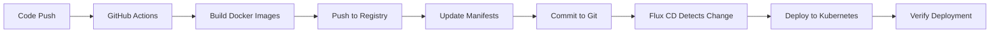

# 🚀 CI/CD Pipeline Setup Guide

This guide explains how to set up a complete CI/CD pipeline with GitHub Actions and Flux CD for your blog infrastructure.

## 🔄 **Complete CI/CD Flow:**



## 🛠️ **Setup Steps:**

### **1. GitHub Repository Settings:**

#### **Enable GitHub Container Registry:**
1. Go to your repository settings
2. Navigate to "Actions" → "General"
3. Enable "Read and write permissions"
4. Enable "Allow GitHub Actions to create and approve pull requests"

#### **Add Required Secrets:**
```bash
# Add these secrets in your GitHub repository settings:
KUBE_CONFIG=<base64-encoded-kubeconfig>
```

To get your kubeconfig:
```bash
# On your server
cat ~/.kube/config | base64 -w 0
```

### **2. Flux CD Setup:**

#### **Create Image Update Policy:**
```yaml
# clusters/prod/apps/blog/image-update-policy.yaml
apiVersion: image.toolkit.fluxcd.io/v1beta1
kind: ImagePolicy
metadata:
  name: blog-image-policy
  namespace: flux-system
spec:
  imageRepositoryRef:
    name: blog-image-repo
  policy:
    semver:
      range: '>=1.0.0'
  filterTags:
    pattern: '^main-.*$'
    extract: '$VERSION'
```

#### **Create Image Repository:**
```yaml
# clusters/prod/apps/blog/image-repository.yaml
apiVersion: image.toolkit.fluxcd.io/v1beta1
kind: ImageRepository
metadata:
  name: blog-image-repo
  namespace: flux-system
spec:
  image: ghcr.io/sudhan30/my-blog-site-cluster-infra/blog-site
  interval: 1m
```

### **3. Kubernetes Secrets:**

#### **Create Registry Credentials:**
```bash
# Create GitHub Container Registry credentials
kubectl create secret docker-registry ghcr-secret \
  --docker-server=ghcr.io \
  --docker-username=$GITHUB_USERNAME \
  --docker-password=$GITHUB_TOKEN \
  --docker-email=$GITHUB_EMAIL \
  --namespace=web
```

#### **Update Deployments to Use Registry Secret:**
```yaml
# Add to your deployments
spec:
  template:
    spec:
      imagePullSecrets:
        - name: ghcr-secret
```

## 🔧 **How It Works:**

### **On Every Push to Main:**

1. **GitHub Actions Triggers:**
   - Builds blog Docker image
   - Builds backend Docker image
   - Pushes images to GitHub Container Registry
   - Updates Kubernetes manifests with new image tags
   - Commits changes back to Git

2. **Flux CD Detects Changes:**
   - Monitors Git repository
   - Detects updated manifests
   - Applies changes to Kubernetes cluster
   - Updates running deployments

3. **Kubernetes Deploys:**
   - Pulls new images from registry
   - Updates pods with new images
   - Verifies health checks
   - Completes rollout

## 📋 **Current Status:**

### **✅ What's Working:**
- GitHub Actions workflow configured
- Docker images will be built automatically
- Manifests will be updated with new image tags
- Flux CD will detect and apply changes

### **🔧 What You Need to Do:**

1. **Enable GitHub Actions:**
   ```bash
   # Push the workflow files
   git add .github/
   git commit -m "Add CI/CD pipeline with GitHub Actions"
   git push origin main
   ```

2. **Set Up Secrets:**
   - Add `KUBE_CONFIG` secret in GitHub repository settings
   - Ensure GitHub Actions has write permissions

3. **Create Registry Credentials:**
   ```bash
   # On your server
   kubectl create secret docker-registry ghcr-secret \
     --docker-server=ghcr.io \
     --docker-username=sudhan30 \
     --docker-password=$GITHUB_TOKEN \
     --docker-email=your-email@example.com \
     --namespace=web
   ```

4. **Update Deployments:**
   ```bash
   # The deployments are already updated to use the new images
   kubectl apply -k clusters/prod/
   ```

## 🎯 **Expected Flow:**

### **After Push to Main:**
```bash
# 1. GitHub Actions builds images
✅ Building blog-site:latest
✅ Building blog-backend:latest
✅ Pushing to ghcr.io/sudhan30/my-blog-site-cluster-infra/

# 2. Manifests updated
✅ Updated blog deployment with new image tag
✅ Updated backend deployment with new image tag
✅ Committed changes to Git

# 3. Flux CD detects changes
✅ Git repository reconciled
✅ Kustomizations reconciled
✅ Deployments updated

# 4. Kubernetes deploys
✅ New pods created with new images
✅ Health checks pass
✅ Deployment complete
```

## 🚨 **Troubleshooting:**

### **If GitHub Actions Fails:**
```bash
# Check GitHub Actions logs
# Go to your repository → Actions tab
# Look for failed workflows
```

### **If Flux Doesn't Sync:**
```bash
# Check Flux status
flux get kustomizations -n flux-system
flux get sources git -n flux-system

# Force reconciliation
flux reconcile source git blog-repo -n flux-system
flux reconcile kustomization blog -n flux-system
```

### **If Images Don't Update:**
```bash
# Check image pull secrets
kubectl get secrets -n web

# Check pod events
kubectl describe pods -n web -l app=blog
kubectl describe pods -n web -l app=blog-backend

# Check image pull policy
kubectl get pods -n web -o jsonpath='{.items[*].spec.containers[*].imagePullPolicy}'
```

## 📊 **Monitoring the Pipeline:**

### **GitHub Actions:**
- Go to your repository → Actions tab
- Monitor workflow runs
- Check build logs and deployment status

### **Flux CD:**
```bash
# Check Flux status
flux get kustomizations -n flux-system
flux get sources git -n flux-system
flux get images -n flux-system
```

### **Kubernetes:**
```bash
# Check deployment status
kubectl get deployments -n web
kubectl get pods -n web
kubectl rollout status deployment/blog -n web
kubectl rollout status deployment/blog-backend -n web
```

## 🎉 **Success Criteria:**

Your CI/CD pipeline is working if:

✅ **GitHub Actions** builds images successfully  
✅ **Images are pushed** to GitHub Container Registry  
✅ **Manifests are updated** with new image tags  
✅ **Flux CD detects** the changes  
✅ **Kubernetes deploys** the new images  
✅ **Health checks pass** after deployment  
✅ **Services are accessible** with new images  

## 🚀 **Next Steps:**

1. **Push the changes** to trigger the pipeline
2. **Monitor GitHub Actions** for build status
3. **Check Flux CD** for sync status
4. **Verify deployment** in Kubernetes
5. **Test the updated** services

---

**🎯 Your complete CI/CD pipeline is ready!**

*Every push to main will now automatically build, deploy, and update your blog infrastructure.*
